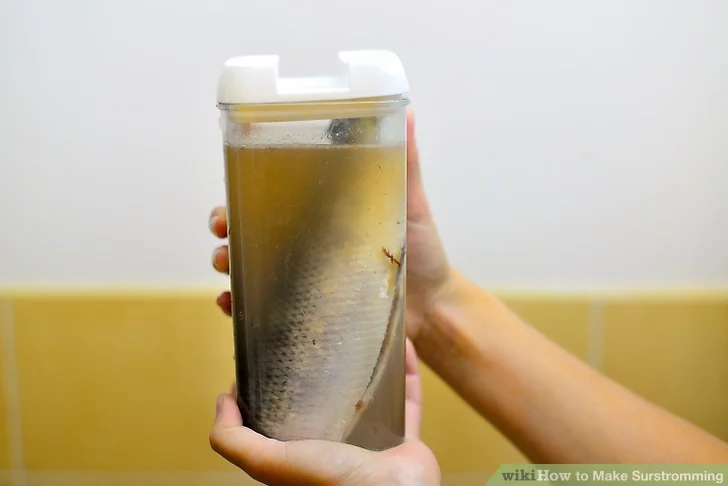
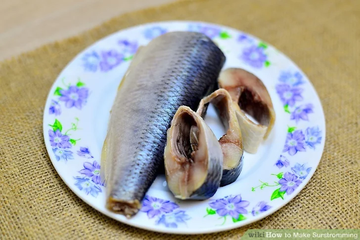

# Sour Herring (Surströmming)

## Info
Sour herring is herring preserved by fermentation. The gutted fish is salted, placed in open vats and left to ferment as the herring, through autolysis (its own enzymes) and together with bacteria, forms strong-smelling acids such as propanoic acid, butyric acid and acetic acid from simple sugars in the fish. Hydrogen sulphide is also formed. The herring is then placed in cans for secondary fermentation.

Sour herring is sold both whole and as fillets.

## Ingredients
- 80 to 90 lb freshly caught herring
- 60 liter (16 qt) barrel with ventilation valve

## Step 1

**Buy fresh herring during the traditional months of May and June.** You don't want the rotted fish to sit around too long, but you want to be sure there is plenty of time for it to ferment during the traditional surstromming feasting time of late August and early September.
- Make sure to also have a bucket for reserved brine.

## Step 2

**Brine the herring for a day.** Leave the salt concentration a bit on the light side. It should measure about 23 degrees with your salinometer. After all, surstromming was created specifically because the locals didn't have enough salt to preserve fish in the normal way.

## Step 3

**Decapitate and clean the herring.** Fish heads and guts aren't part of the classic recipe and would ruin the distinctive taste of surstromming. Leave them out for the local cats, if you wish.

## Step 4

**Put the decapitated, cleaned fish into a barrel, leaving an inch for any gas to escape without causing an explosion.** Yes, surstromming has been known to explode or fizz out.

## Step 5

**Leave it out in the sun for 24 hours to begin the fermentation process.** This crucial step jump-starts the process and gets that rot underway. Stir it every 3 hours to achieve an even putrefaction throughout the mixture.

## Step 6

**Reserve about 5 quarts of brine and pour off the rest.** Mix the reserved brine back in and add about 5 gallons of 12 degree brine.

## Step 7

**Move it indoors to a cool, dark place to let the fermentation continue until mid-August.** Surstromming experts recommend that it be kept at a temperature of 63-65ºF(17-18ºC).

## Finished!

